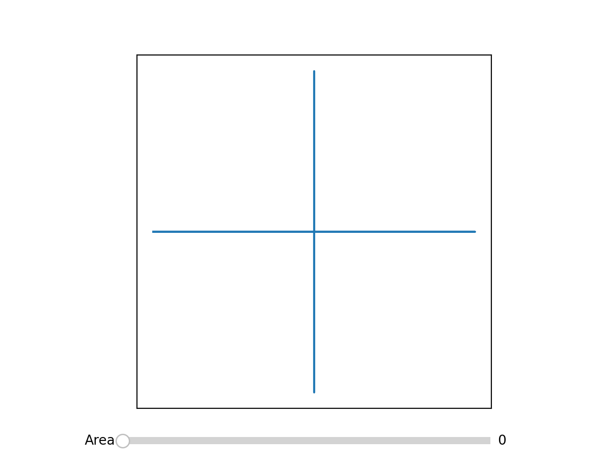

# SuperellipseInterpolation

Repository showcasing how to interpolate between different superellipses based on their area.

For simplicity, this repository handles superellipses on the form

|x|^b + |y|^b = 1

## Animation

